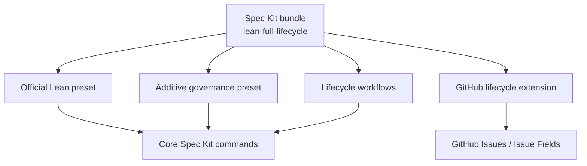

# Lean Full-Lifecycle for Spec Kit

This repository is a **Spec Kit bundle source**, not a separate development
framework.

It preserves Spec Kit's core SDD loop and installs:

- the official Lean preset;
- an additive Engineering/Lifecycle Governance preset;
- fourteen lifecycle workflows;
- one narrowly scoped GitHub lifecycle extension.



## What remains core Spec Kit

The bundle does not replace:

```text
speckit.constitution
speckit.specify
speckit.clarify
speckit.plan
speckit.checklist
speckit.tasks
speckit.analyze
speckit.implement
speckit.converge
```

The governance preset appends rules to those commands. Workflows orchestrate
them. The extension only implements GitHub-specific lifecycle operations.

## Fastest path

- [Install locally into a product repository](INSTALL-LOCAL.md)
- [Validation status and limitations](VALIDATION.md)
- [Packaging decisions](PACKAGING-DECISIONS.md)
- [Implementation roadmap to `1.0.0`](docs/implementation-roadmap.md)
- [Component architecture](docs/architecture.md)
- [Security and trust](docs/security.md)

## Repository layout

```text
bundle/                       <- the packaged surface; everything else is source tooling
  bundle.yml
  README.md
  components/
    presets/lean-full-lifecycle-governance/
    extensions/github-lifecycle/
    workflows/
policy/                       canonical policy, mirrored into the governance preset
catalogs/
scripts/
tests/
docs/
```

Spec Kit packages the entire bundle directory and honours no ignore file, so
development tooling is kept outside `bundle/` rather than excluded from it.

## Toolchain

Make owns the task definitions:

```bash
make generate      # regenerate bundle.yml and the catalogs
make validate      # invariants + traceability
make test          # pytest
make build         # component archives
make smoke         # full install lifecycle over a local catalog
```

Devbox is optional and wraps them. It provisions a pinned toolchain and
supervises long-running processes; its scripts only delegate to Make.

```bash
devbox run validate           # same as make validate, in a pinned environment
devbox services up catalog    # serve the local catalog for install testing
```

Do not confuse this with the *target project's* Devbox requirement: five of the
fourteen workflows run `devbox run verify` or `devbox run release-verify`, and the
product repository must provide those.

## Prerequisite

Install the approved Spec Kit release. This source targets Spec Kit 1.0.1 or
later.

```bash
uv tool install specify-cli   --from git+https://github.com/github/spec-kit.git@v1.0.1
```

Also provide the target project's approved Devbox, OpenCode, GitHub CLI, and Git
setup as applicable.

## Local development install

The source components are unpublished, so install them directly first. The
helper then installs the local bundle manifest to record bundle provenance.

Dry-run:

```bash
python scripts/local_catalog.py dev-install --target /absolute/path/to/your-project
```

Install:

```bash
python scripts/local_catalog.py install --target /absolute/path/to/your-project
```

The target project is initialized explicitly if needed. The source repository
remains separate from the product repository.

## Run workflows

Inside the target project:

```bash
specify workflow run lifecycle-greenfield-bootstrap   -i product_context="Build ..."

specify workflow run lifecycle-story-delivery   -i issue_ref="#142"   -i intent="Allow users to pause subscriptions"
```

See [Workflow guide](docs/workflows.md).

## Published installation

After replacing `YOUR-ORG`, publishing immutable component archives, and
hosting the catalogs:

```bash
specify preset catalog add <preset-catalog-url>   --name lean-full-lifecycle   --install-allowed

specify extension catalog add <extension-catalog-url>   --name lean-full-lifecycle   --install-allowed

specify workflow catalog add <workflow-catalog-url>   --name lean-full-lifecycle

specify bundle catalog add <bundle-catalog-url>   --id lean-full-lifecycle   --policy install-allowed

specify bundle install lean-full-lifecycle
```

A built bundle ZIP still needs its non-default component references to resolve
from bundled/installed components or active install-allowed catalogs.

## Validate and build

```bash
python scripts/validate_source.py
python -m pytest
python scripts/build_release.py
```

When `specify` is installed:

```bash
specify bundle validate --path bundle/ --offline
specify bundle build --path bundle/ --output dist/
python scripts/smoke_test.py --integration opencode   # any Spec Kit integration
```

The included validator checks source structure and safety invariants. It is not
a replacement for the official Spec Kit validator.

## Trust model

Workflow shell steps are limited to fixed Devbox commands and never interpolate
user or agent text. GitHub mutations require a deterministic plan, human gate,
and read-back verification.

Review [Security and trust](docs/security.md) before installation.
