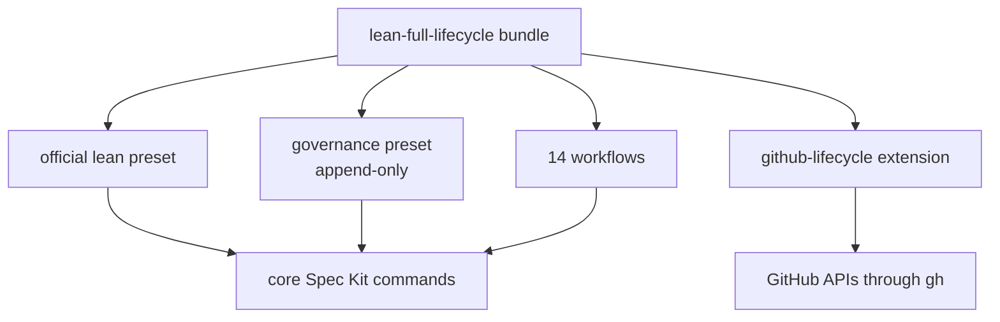

# Component architecture

The product is a Spec Kit **bundle**, not a new runtime.

## Boundaries

### Core Spec Kit

Owns specifications, plans, tasks, implementation guidance, analysis, and
convergence.

### Governance preset

Appends Engineering Excellence, risk, lifecycle, brownfield, Output Done, and
outcome principles. It does not fork the core commands.

### Workflows

Own sequencing, branching-by-instruction, fixed verification commands, and
human gates.

### GitHub extension

Owns provider-specific inspection, planning, Issue Field transitions,
deduplicated capture, and native issue relationships.

A future Jira/Linear adapter can implement equivalent semantic operations
without changing the workflows' product/engineering principles.
