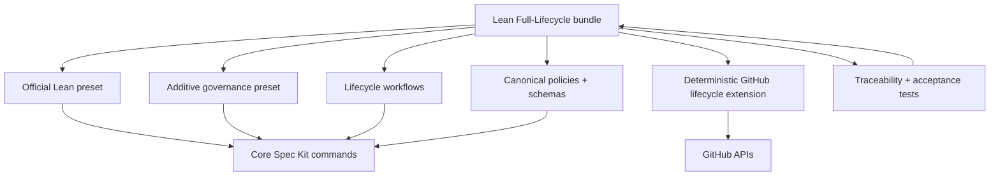
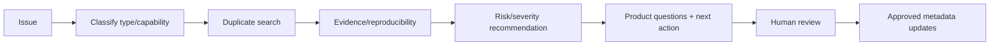
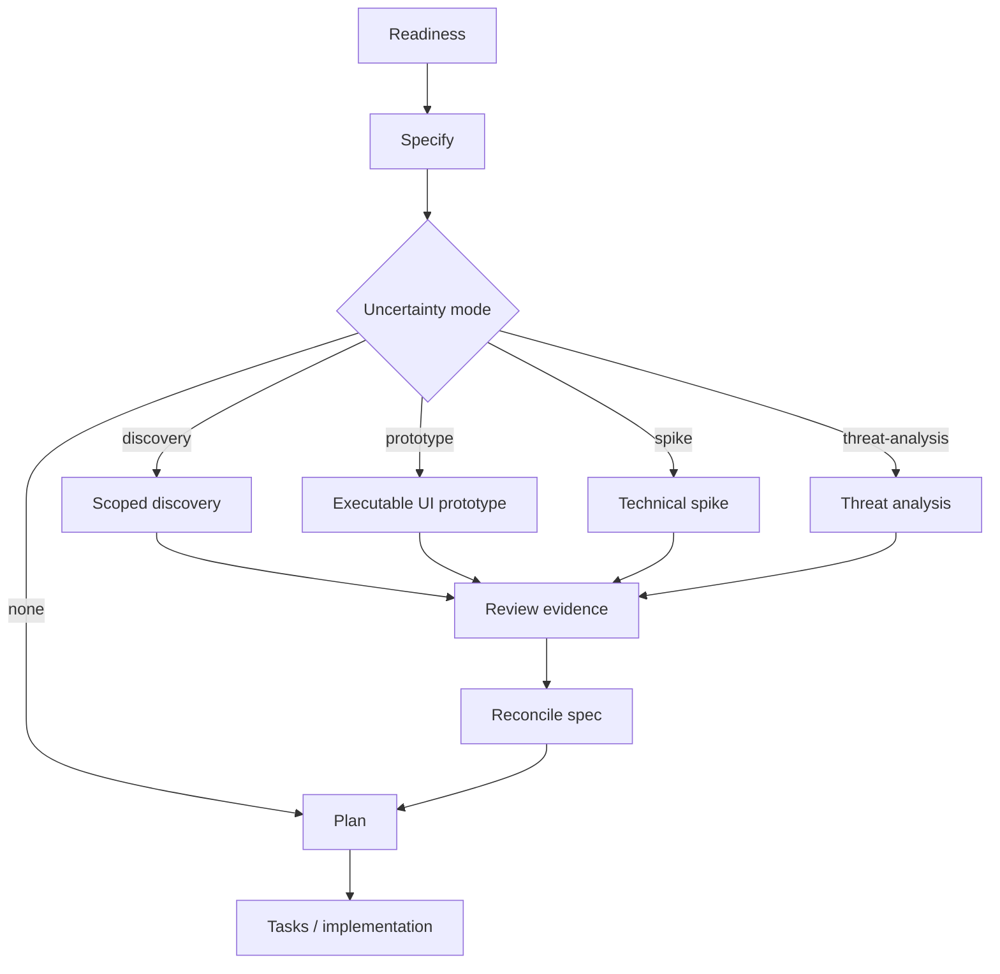
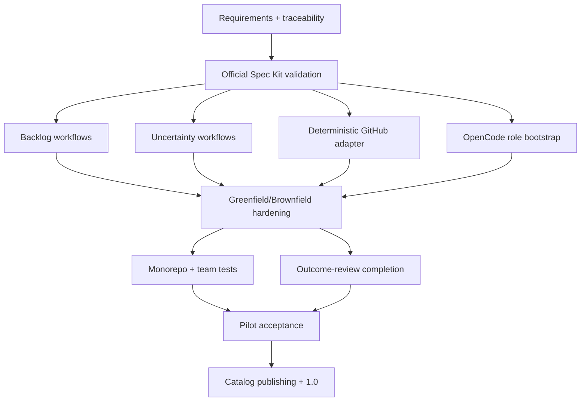
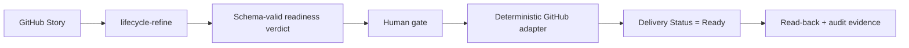

# Implementation roadmap: source design to supported 1.0 bundle

This roadmap turns the current pilot-ready Spec Kit bundle source into a
complete, tested, installable, and supportable `1.0.0` release without losing
the principles already established.

The roadmap is deliberately implementation-oriented. Every requirement must
end with:

```text
requirement
→ owning component
→ implementation
→ automated test
→ acceptance scenario
→ release evidence
```

The current `0.1.0` source is the frozen baseline.

## Success definition

The bundle is complete only when it:

- remains a Spec Kit-native bundle rather than a competing runtime;
- retains the official Lean preset and core Spec Kit commands;
- supports genuine greenfield and brownfield operation;
- supports ongoing backlog triage, refinement, decomposition, and capture;
- supports executable prototypes, technical spikes, discovery, and threat
  analysis as conditional uncertainty-resolution paths;
- completes the Outcome Done loop;
- provides deterministic, audited GitHub lifecycle operations;
- configures approved OpenCode model roles and permissions safely;
- installs, updates, removes, and reinstalls cleanly;
- passes official Spec Kit validation/build and real sandbox acceptance tests;
- publishes immutable, checksummed component and bundle artifacts;
- has no untraced requirement or untested critical capability.

## Target architecture



The target remains:

```text
1 official Lean preset
1 additive governance preset
1 GitHub integration extension
15 lifecycle workflows
0 replacement runtimes
0 forks of Spec Kit core
```

## Release sequence

| Release | Purpose | Exit condition |
|---|---|---|
| `0.1.1` | Establish executable traceability and prove official Spec Kit substrate | Official validate/build/install lifecycle passes |
| `0.2.0` | Complete backlog, uncertainty, and outcome workflows | All lifecycle loops exist and pass sandbox tests |
| `0.3.0` | Replace routine agent-driven infrastructure mutations | Deterministic GitHub adapter and OpenCode role bootstrap pass |
| `0.9.0` | Full acceptance and pilot hardening | Greenfield, brownfield, monorepo, and security suites pass |
| `1.0.0` | Publish supported bundle | Catalog install/update/remove and release governance pass |

---

# Phase 0 — Establish executable completeness control

Do this before adding more features. It is the mechanism that prevents future
omissions.

## Deliverables

```text
requirements/
├── requirements.yml
├── traceability.yml
├── acceptance-scenarios.yml
└── release-gates.yml

schemas/
├── requirement.schema.json
├── traceability.schema.json
└── acceptance-scenario.schema.json

scripts/
├── validate_requirements.py
└── generate_coverage_report.py
```

## Requirement format

Each requirement receives a stable ID, source, owning components, acceptance
tests, release target, and completion evidence.

Example:

```yaml
id: REQ-BACKLOG-DECOMPOSE-001
statement: >
  Epic refinement supports repeated rolling-wave decomposition and creates
  only enough bounded Stories for the configured planning horizon.
source: framework_discussion
priority: must

components:
  - workflow:lifecycle-decompose
  - extension:github-lifecycle.link

acceptance_tests:
  - AT-DECOMPOSE-001
  - AT-DECOMPOSE-002
  - AT-DECOMPOSE-003

release: 0.2.0
status: planned
evidence: []
```

## Requirement families

At minimum:

| Family | Scope |
|---|---|
| `REQ-CORE-*` | preserve Spec Kit and official Lean behavior |
| `REQ-GREEN-*` | framework-only and product greenfield bootstrap |
| `REQ-BROWN-*` | scoped discovery, reconciliation, quality ratchet |
| `REQ-BACKLOG-*` | triage, refine, decompose, capture |
| `REQ-UNCERTAINTY-*` | discovery, prototype, spike, threat-analysis paths |
| `REQ-ENGINEERING-*` | TDD, testing, quality, observability, security |
| `REQ-TEAM-*` | parallel ownership, worktrees, dependencies |
| `REQ-STATE-*` | readiness, Output Done, Outcome Done |
| `REQ-GITHUB-*` | Issue Fields, hierarchy, dependencies, visual UI |
| `REQ-AGENT-*` | OpenCode roles, models, permissions, data policy |
| `REQ-DEVBOX-*` | reproducible environment and fixed commands |
| `REQ-RELEASE-*` | release, rollout, outcome measurement |
| `REQ-INCIDENT-*` | emergency changes and reconciliation |
| `REQ-RETIRE-*` | deprecation and retirement |
| `REQ-MONOREPO-*` | project/feature context and multi-repo initiatives |
| `REQ-PACKAGE-*` | install, update, remove, catalog, provenance |
| `REQ-SECURITY-*` | prompt injection, secrets, plugins, supply chain |
| `REQ-DOCS-*` | modular docs, links, schemas, anti-rot |

## CI rules

Fail CI when:

- a requirement has no owning component;
- a requirement has no acceptance scenario;
- a component has no mapped requirement;
- a required acceptance scenario has no implementation;
- a requirement is marked complete without passing evidence;
- a release gate references a missing test;
- a deprecated requirement is removed without a migration/decision record.

## Phase 0 exit gate

- [ ] Every agreed requirement has a stable ID.
- [ ] Every requirement has an owner role.
- [ ] Every requirement maps to at least one component.
- [ ] Every `must` requirement maps to at least one acceptance scenario.
- [ ] Coverage report is generated in CI.
- [ ] Missing traceability makes CI fail.

---

# Phase 1 — Prove the official Spec Kit foundation

The local structural validator is useful, but the official Spec Kit CLI is the
authority for bundle compatibility.

## Development environment

Create a reproducible Devbox environment containing:

- pinned Spec Kit;
- Python and development dependencies;
- OpenCode;
- GitHub CLI;
- Git;
- lint/test/schema tools.

Expose:

```text
devbox run validate
devbox run test
devbox run build
devbox run smoke
devbox run verify
```

## Official validation

Run:

```bash
specify bundle validate --path .
specify bundle build --path . --output dist/
```

Then test in a clean empty repository:

```text
bundle install
bundle list
bundle info
second install
bundle update
bundle remove
reinstall
```

Repeat in an existing Spec Kit repository.

## Verify composition

Confirm:

- official Lean is installed at priority `20`, strategy `replace`;
- governance is installed at priority `10`, strategy `append`;
- all intended core commands resolve;
- all workflows resolve;
- OpenCode remains the active integration;
- project workflow overlays survive update;
- removal preserves components referenced by other installed bundles;
- failed installation rolls back cleanly;
- repeated install/update is idempotent.

## Compatibility matrix

| Dimension | Cases |
|---|---|
| OS | Linux, macOS, Windows/PowerShell where supported |
| Repository | empty, existing Spec Kit, non-Git, monorepo member |
| Integration | OpenCode primary, Claude Code smoke compatibility |
| Install source | local directory, built ZIP, hosted catalog ID |
| Lifecycle | install, second install, update, remove, reinstall |

## Phase 1 exit gate

- [ ] Official bundle validation passes.
- [ ] Official bundle build passes.
- [ ] Clean install passes.
- [ ] Second install creates no unintended change.
- [ ] Update passes.
- [ ] Remove/reinstall passes.
- [ ] Project overlays survive update.
- [ ] All required core commands resolve.
- [ ] Install failure rolls back or reports a safe recoverable state.

---

# Phase 2 — Complete day-to-day backlog operations

The baseline contains capture support, but complete operation needs dedicated
triage, refinement, decomposition, and reusable discovery workflows.

## Add `lifecycle-triage`

Inputs:

```text
issue_ref
integration
triage_verdict
```

Flow:



It must not:

- commit roadmap priority autonomously;
- move an item directly to Ready;
- convert weak observations into issues;
- treat inferred implementation behavior as intended behavior.

## Add `lifecycle-refine`

Flow:

```text
inspect item
→ refine problem/outcome
→ refine Acceptance Criteria
→ identify dependencies
→ classify risk
→ identify spec impact
→ choose uncertainty mode
→ emit structured readiness verdict
→ validate schema
→ human approval
→ transition Refining → Ready
```

Readiness record:

```yaml
readiness: ready
blocking_questions: []
risk: medium
spec_impact: create
material_uncertainty: prototype
next_engineering_action: Build a planning prototype.
```

Rules:

- NOT READY remains Refining.
- Technical design is not a prerequisite for Ready.
- A transition requires a deterministic GitHub plan, approval, mutation, and
  read-back.
- Re-running the same refinement is idempotent.

## Add `lifecycle-decompose`

Inputs:

```text
epic_ref
target_ready_count
maximum_new_children
planning_horizon
integration
approval verdict
```

Flow:

```text
inspect Epic and current children
→ inspect completed/in-progress work
→ inspect Ready queue
→ propose only enough bounded Stories
→ detect duplicates
→ propose split/merge/retire actions
→ human review
→ create/update approved children
→ establish native parent relationships
→ read back relationships
→ report intentionally undecomposed scope
```

Rules:

- decomposition is rolling-wave, not one-shot;
- a rerun does not create duplicates;
- new children begin Inbox/Refining unless separately refined;
- Epic progress is derived from child completion;
- child creation never silently commits P0/P1 or roadmap dates.

## Add `lifecycle-discover`

A reusable bounded discovery workflow for ongoing work.

It produces:

- capability boundary;
- entry points/modules;
- data ownership;
- external dependencies;
- trust boundaries;
- current tests/behavior;
- existing intended behavior/evidence;
- uncertainty and inconsistencies;
- safe seams;
- security/operability observations.

It must not promote inferred code behavior to authoritative intent without
reconciliation.

## Phase 2 acceptance scenarios

| Scenario | Expected result |
|---|---|
| duplicate bug | links existing issue |
| weak observation | remains discovery note |
| refinement has blocker | item remains Refining |
| valid readiness verdict | item moves Ready after approval/read-back |
| first decomposition pass | creates only next horizon |
| second pass with new evidence | adds only newly justified Stories |
| unchanged rerun | creates nothing |
| oversized Story | proposes/executes approved split |
| obsolete proposed Story | retires/supersedes without data loss |
| child issue creation | native parent relationship read back |

## Phase 2 exit gate

- [ ] Four workflows implemented.
- [ ] Structured readiness schema enforced.
- [ ] Repeated decomposition is idempotent.
- [ ] Duplicate detection has fixture/integration tests.
- [ ] Native hierarchy is used and read back.
- [ ] Ready queue can be maintained without manual prose interpretation.

---

# Phase 3 — Implement uncertainty-resolution workflows

This is a core original requirement and must exist as executable workflow
behavior, not only policy prose.

## Add workflows

```text
lifecycle-prototype
lifecycle-spike
```

Use `lifecycle-discover` from Phase 2 for discovery mode.

Modify `lifecycle-story-delivery` to support:

```text
uncertainty_mode:
  none
  discovery
  prototype
  spike
  threat-analysis
```

## Target Story flow



## Prototype contract

A prototype must:

- answer named UI/interaction questions;
- use fake/local data;
- avoid production credentials and production data;
- use the real design system where practical;
- run through Devbox;
- implement only required learning journeys;
- record findings and decisions;
- update/reconcile the spec;
- end in `delete`, `archive`, or explicitly approved `promote`.

Prototype code must not become production code accidentally.

## Spike contract

A spike defines:

- question;
- permitted scope;
- required evidence;
- time/cost boundary;
- exit criteria;
- result;
- decision;
- disposal/promotion policy.

## Threat-analysis path

High-risk work should produce:

- assets;
- changed trust boundaries;
- attacker-controlled inputs;
- abuse cases;
- required controls;
- negative/security verification;
- review authority.

## Avoiding workflow drift

Standalone uncertainty workflows and embedded Story branches should be
generated from shared source fragments or tested for semantic parity.

```text
shared workflow fragments
→ generated workflow packages
→ committed generated output
→ CI regeneration-diff check
```

## Phase 3 exit gate

- [ ] Prototype workflow runs end-to-end.
- [ ] Spike workflow runs end-to-end.
- [ ] Story workflow branches correctly for all uncertainty modes.
- [ ] Spec reconciliation is mandatory after learning.
- [ ] Prototype/spike disposal state is recorded.
- [ ] No user/agent text is interpolated into shell commands.

---

# Phase 4 — Complete outcome validation

The current release workflow starts measurement. Add a workflow that evaluates
and closes the outcome loop.

## Add `lifecycle-outcome-review`

Flow:

```text
load outcome record
→ validate schema
→ confirm observation window/sample
→ assess data quality/privacy
→ compare target
→ compare guardrails
→ summarize evidence
→ product/analytics human gate
→ transition:
   Outcome Validated
   or Outcome Missed / Inconclusive
→ capture follow-up learning
```

Rules:

- the agent may summarize and recommend;
- only authorized product/analytics roles decide validation;
- insufficient evidence remains Measuring;
- target success with guardrail regression is not validated;
- failed/inconclusive outcomes feed deduplicated backlog capture;
- completed engineering work remains Output Done.

## Acceptance scenarios

| Scenario | Result |
|---|---|
| target met, guardrails healthy | Outcome Validated |
| target missed | Missed/Inconclusive + capture |
| target met, reliability guardrail regressed | not validated |
| sample/window insufficient | remains Measuring |
| missing/invalid data source | blocked, no transition |
| data-quality concern | human review required |

## Phase 4 exit gate

- [ ] Outcome schema is validated.
- [ ] Authorized gate controls final status.
- [ ] Follow-up capture is deduplicated.
- [ ] Output Done and Outcome Status remain independent.

---

# Phase 5 — Implement OpenCode model-role bootstrap

The current policy defines roles but leaves mappings intentionally unresolved.

## Add

```text
lifecycle-agent-bootstrap
scripts/resolve_opencode_models.py
templates/opencode-agents/
```

## Flow

```text
detect OpenCode version/config generation
→ refresh/list available models
→ restrict to approved providers
→ propose role mapping
→ human approval
→ generate project agent/config files
→ validate exact model IDs
→ exercise permissions
```

Roles:

```text
fast
planner
architect
builder
long_horizon_builder
reviewer
security
```

Enforce:

- reviewer uses a different family from builder where available;
- reviewer is read-only;
- provider allowlist;
- session sharing disabled;
- shell asks by default;
- fixed Devbox validation commands allowed;
- protected pushes denied;
- production deployment gated;
- plugin/MCP/skill installation denied or gated;
- model IDs verified against installed inventory;
- cost/token/runtime/retry/tool-loop ceilings;
- resolved mapping and evaluation date recorded.

## Phase 5 exit gate

- [ ] Both supported OpenCode config generations are detected correctly.
- [ ] Approved provider policy is enforced.
- [ ] Invalid/unavailable model IDs fail clearly.
- [ ] Reviewer edit-denial is tested.
- [ ] Destructive/protected commands are denied in tests.
- [ ] Model-role mapping is replaceable without changing lifecycle workflows.

---

# Phase 6 — Replace routine agent-driven GitHub mutation

Keep one GitHub extension, but move routine infrastructure mutations into
deterministic, tested scripts or a least-privilege GitHub App.

## Target structure

```text
components/extensions/github-lifecycle/
├── commands/
├── scripts/
│   ├── github_api.py
│   ├── inspect.py
│   ├── plan.py
│   ├── transition.py
│   ├── capture.py
│   ├── relationships.py
│   └── deduplicate.py
├── schemas/
├── fixtures/
└── tests/
```

## Inspection

Implement:

- repository/organization resolution;
- Issue Field/option resolution;
- Issue Type inspection;
- current issue values;
- duplicate Project-local field detection;
- fallback mode detection;
- permission/topology reporting.

## Transition

Implement:

- transition validation against `state-machine.yml`;
- authority/evidence validation;
- stable field/option ID resolution;
- mutation of exactly one intended value;
- read-after-write;
- audit record;
- optional completed closure only after Output Done;
- never infer Output Done from arbitrary issue closure.

## Capture

Implement:

- duplicate search;
- approved issue creation;
- native Issue Type;
- native parent relationship;
- Delivery Status Inbox;
- approved structured fields;
- read-back of all written state;
- provenance/audit evidence.

## Relationships

Implement:

- parent/sub-issue;
- blocked-by/blocking;
- cycle detection;
- idempotent repeated linking;
- read-back.

## Reliability and security

- API-version pinning;
- pagination;
- retries/backoff/jitter;
- secondary-rate-limit handling;
- operation IDs/idempotency;
- partial-failure recovery;
- structured audit log;
- redaction;
- dry-run;
- fixture tests;
- sandbox integration tests.

## Authentication

Support:

```text
local development
→ gh/fine-grained token

organization automation
→ least-privilege GitHub App
```

Separate organization schema administration from routine issue-value
transitions.

## Phase 6 exit gate

- [ ] Routine transitions no longer depend on free-form agent shell/API logic.
- [ ] Every write has approved deterministic plan and read-back.
- [ ] Rate-limit/retry/partial-failure tests pass.
- [ ] Duplicate capture is idempotent.
- [ ] Sandbox organization integration tests pass.
- [ ] Audit evidence contains no secrets.

---

# Phase 7 — Harden greenfield and brownfield correctness

## Greenfield mismatch gate

Before greenfield mutation:

```text
only environment/config/scaffolding
→ continue greenfield

meaningful application/domain implementation
→ stop
→ recommend brownfield adoption
```

Use automated evidence plus a human gate; file-count heuristics alone cannot
determine intent reliably.

## Verification-command bootstrap

At bootstrap, detect:

```text
devbox run verify
devbox run release-verify
```

If missing:

- generate approved minimal scripts when stack decisions exist; or
- create a project workflow overlay pointing to equivalent approved commands.

Do not let the user discover this only after the first workflow failure.

## Brownfield hardening scenarios

Test:

- no-target shallow scan only;
- targeted defect;
- targeted feature;
- failing existing test suite;
- no tests;
- scoped legacy exception;
- risky database migration;
- auth/security-sensitive change;
- unrelated dependency upgrade is avoided;
- prompt-injection content in code/issues;
- production data remains denied/redacted;
- no whole-estate spec or modernization backlog.

## Phase 7 exit gate

- [ ] Greenfield mismatch is explicit and safe.
- [ ] Verification command or overlay exists after bootstrap.
- [ ] Brownfield no-target mode modifies no application code.
- [ ] Quality-ratchet and exception policies are enforced.
- [ ] Sensitive-data handling tests pass.

---

# Phase 8 — Monorepo, worktree, and parallel-team hardening

Spec Kit project context and active feature context must be tested separately.

Validate:

```text
SPECIFY_INIT_DIR
→ selected project/member

SPECIFY_FEATURE_DIRECTORY or .specify/feature.json
→ selected feature inside that project
```

Changing Git branches alone must not be assumed to switch active feature.

## Acceptance scenarios

```text
one monorepo
→ two member Spec Kit projects
→ concurrent worktrees
→ distinct active features
→ no artifact cross-contamination
```

Also test:

- Git root vs Spec Kit project root;
- project-specific Constitution selection;
- shared foundation integrated before dependent Stories;
- project overlays survive updates;
- native issue dependencies;
- CODEOWNERS/rulesets;
- merge queue where configured;
- multiple PRs for one Story preserve coherent Acceptance Criteria;
- cross-repo initiative ownership and contract versioning.

## Phase 8 exit gate

- [ ] Monorepo member targeting passes.
- [ ] Worktree feature targeting passes.
- [ ] No cross-feature artifact contamination.
- [ ] Parallel ownership/dependency tests pass.
- [ ] Overlay/update behavior passes.

---

# Phase 9 — Build the complete acceptance suite

## Bundle mechanics

- [ ] Official validation.
- [ ] Official build.
- [ ] Local-directory install.
- [ ] Built-ZIP install.
- [ ] Catalog install.
- [ ] Second install idempotency.
- [ ] Update.
- [ ] Remove.
- [ ] Reinstall.
- [ ] Overlay preservation.
- [ ] Failed-install rollback.

## Greenfield

- [ ] Framework-only empty repo.
- [ ] Product bootstrap empty repo.
- [ ] UI-heavy product uses prototype.
- [ ] Backend product skips prototype.
- [ ] Meaningful code triggers brownfield handoff.
- [ ] First Ready queue is bounded.
- [ ] First Story is not implemented during bootstrap.

## Brownfield

- [ ] No-target shallow adoption.
- [ ] Targeted bug with regression test.
- [ ] Targeted feature with characterization safety.
- [ ] Legacy hotspot.
- [ ] Data migration.
- [ ] Security-sensitive change.
- [ ] No unrelated rewrite/churn.
- [ ] Scoped exception expiry/ownership.
- [ ] Production evidence is minimized/redacted.

## Backlog

- [ ] Duplicate triage.
- [ ] Security finding triage.
- [ ] Not-ready refinement.
- [ ] Ready refinement.
- [ ] First and second decomposition waves.
- [ ] Split/merge/retire Story.
- [ ] Technical finding capture.
- [ ] Failed-outcome capture.

## Security

- [ ] Issue-body prompt injection.
- [ ] Agent-output shell injection.
- [ ] Unapproved protected push.
- [ ] Secret-file read.
- [ ] External-directory access.
- [ ] Unapproved provider.
- [ ] Unapproved MCP/plugin/skill.
- [ ] Organization schema mutation without authority.
- [ ] GitHub read-back mismatch.
- [ ] GitHub rate-limit handling.

## Outcome

- [ ] Validated.
- [ ] Missed.
- [ ] Inconclusive.
- [ ] Guardrail regression.
- [ ] Insufficient observation window.
- [ ] Invalid data source.

## Phase 9 exit gate

All `must` acceptance scenarios pass, and every failure produces a regression
test before its fix is accepted.

---

# Phase 10 — Controlled pilots

Run:

```text
1 genuine greenfield product
1 representative brownfield product
1 monorepo/worktree scenario
1 GitHub sandbox organization
```

Collect:

- workflow completion without manual repair;
- human interventions;
- incorrect/out-of-scope edits;
- readiness accuracy;
- duplicate backlog rate;
- convergence findings;
- Ready-to-Output-Done time;
- failed GitHub operations;
- model cost/runtime;
- test flakiness;
- developer satisfaction;
- generated artifacts archived/deleted vs left stale.

Every pilot failure follows:

```text
requirement/test gap
→ traceability update
→ implementation
→ regression test
→ rerun
```

## Phase 10 exit gate

- [ ] No unresolved critical/high defects.
- [ ] Greenfield pilot completes end-to-end.
- [ ] Brownfield pilot preserves unrelated behavior.
- [ ] GitHub operations have complete read-back/audit evidence.
- [ ] User feedback does not identify blocking ceremony or usability issues.

---

# Phase 11 — Publish `1.0.0`

## Publishing work

- replace all `YOUR-ORG` placeholders;
- publish immutable preset, extension, workflow, and bundle archives;
- publish SHA-256 checksums;
- host reviewed catalogs;
- run strict-publish validation;
- clean-install from hosted catalog;
- update from the last pre-release;
- remove/reinstall cleanly;
- publish migration, support, and security policies;
- publish compatibility matrix;
- publish known limitations and support window.

## `1.0.0` release gates

```text
requirements coverage: 100%
must acceptance scenarios implemented: 100%
must scenarios passing: 100%
official bundle validation/build: PASS
greenfield pilot: PASS
brownfield pilot: PASS
monorepo/worktree test: PASS
GitHub sandbox test: PASS
OpenCode security tests: PASS
catalog install/update/remove: PASS
critical/high unresolved defects: 0
publishing placeholders: 0
documentation/link validation: PASS
reproducible release/source artifacts: PASS
```

---

# Final workflow inventory

## Existing workflows retained

```text
lifecycle-greenfield-bootstrap
lifecycle-brownfield-adoption
lifecycle-story-delivery
lifecycle-bugfix
lifecycle-release-outcome
lifecycle-incident-hotfix
lifecycle-retirement
```

## Workflows to add

```text
lifecycle-triage
lifecycle-refine
lifecycle-decompose
lifecycle-discover
lifecycle-prototype
lifecycle-spike
lifecycle-outcome-review
lifecycle-agent-bootstrap
```

Total:

```text
15 workflows
```

No second extension is required. No custom workflow runtime is required. No
core Spec Kit command is replaced.

---

# Dependency order



---

# Ownership

| Owner role | Accountability |
|---|---|
| Bundle maintainer | manifests, catalogs, versions, compatibility |
| Workflow maintainer | lifecycle behavior, shared fragments, overlays |
| GitHub integration engineer | deterministic API adapter and GitHub App |
| Engineering governance owner | preset, Constitution, quality/risk policy |
| Agent/runtime owner | OpenCode roles, models, permissions |
| Product/process owner | readiness, decomposition, outcome semantics |
| Security reviewer | SSDLC, data/provider/plugin permission review |
| Pilot owners | greenfield/brownfield acceptance evidence |
| Release owner | catalog, checksums, update/remove, release gate |

People may combine roles, but accountability must be named.

---

# Recommended implementation method

Implement one end-to-end vertical slice at a time.

Best first slice:



This proves:

- a new workflow;
- schema validation;
- human approval;
- the GitHub extension;
- Issue Fields;
- deterministic mutation;
- read-back;
- immediate visible value.

Then implement, in order:

```text
lifecycle-decompose
→ lifecycle-discover
→ lifecycle-prototype / lifecycle-spike
→ lifecycle-outcome-review
→ lifecycle-triage / capture hardening
→ lifecycle-agent-bootstrap
→ remaining deterministic GitHub operations
→ full acceptance and publishing
```

Do not ask an agent to implement the entire roadmap in one change. Use one
bounded GitHub Story/spec/PR per vertical slice.

---

# First implementation backlog

A practical initial Epic/Story sequence:

## Epic: Make the bundle officially executable

1. Add requirements/traceability schemas and validator.
2. Add Devbox development environment and commands.
3. Pass official Spec Kit bundle validation.
4. Pass official bundle build.
5. Install/update/remove in an empty sandbox.
6. Prove project overlay preservation.

## Epic: Complete backlog operations

1. Implement `lifecycle-refine`.
2. Implement readiness schema validation.
3. Implement deterministic Issue Field transition.
4. Implement `lifecycle-decompose`.
5. Implement native parent/sub-issue operations.
6. Implement `lifecycle-triage`.
7. Harden capture/deduplication.
8. Implement reusable `lifecycle-discover`.

## Epic: Resolve uncertainty explicitly

1. Implement `lifecycle-prototype`.
2. Implement `lifecycle-spike`.
3. Implement threat-analysis branch.
4. Add uncertainty switch to Story delivery.
5. Add spec reconciliation and disposal decisions.

## Epic: Complete outcomes and runtime setup

1. Implement `lifecycle-outcome-review`.
2. Implement outcome evidence validation and authority.
3. Implement OpenCode model inventory/resolution.
4. Generate role agents and permissions.
5. Add runtime security acceptance tests.

## Epic: Production hardening

1. Complete deterministic GitHub adapter.
2. Add rate-limit/idempotency/audit tests.
3. Harden greenfield mismatch detection.
4. Harden brownfield sensitive-data policy.
5. Add monorepo/worktree suite.
6. Run pilots.
7. Publish catalogs and `1.0.0`.

---

# Immediate next action

Start Phase 0 by creating the requirement catalog and traceability validator.
Do not begin another workflow until CI can prove that every agreed requirement
has an owning component and acceptance test.
